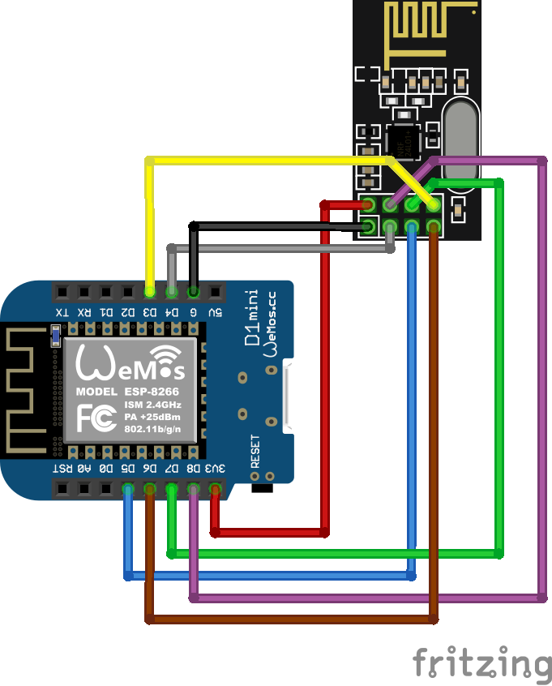

# Getting Started with an ESP8266

Wire Connections

```ditaa
    +-----------+          +-----------+
    |  ESP8266  |--colour--| nRF24L01+ |
    |           |          |           |
    |       GND |---black--|[GND]      |
    |     +3.3V |----red---| VCC       |
    |        D4 |---grey---| CE        |
    |        D8 |--purple--| CSN       |
    |        D5 |---blue---| SCK       |
    |        D7 |---green--| MOSI      |
    |        D6 |---brown--| MISO      |
    |        D3 |--yellow--| IRQ       |
    +-----------+          +-----------+
```



Fritzing diagrams & schematics
* [AhoyMiles_bb.png](./AhoyMiles_bb.png)
* [AhoyMiles_schem.png](./AhoyMiles_schem.png)
* [AhoyMiles.fzz](./AhoyMiles.fzz)

Libraries to be installed in Arduino IDE:
* RF24
* TimeLib

Verify & Compile
* Connect to WiFi Network `ESP AHOY`
* Use password `esp_8266`
* Connect to Network settings 

Setup
* WiFi 
  * Enter SSID `mynetwork`
  * Enter Password `mypassword`
* Device Host Name
  * Enter Device Name `esp-ahoy` 
* General
  * Hoymiles Address (e.g. 114173123456)
  * Choose inverter type
  * Set individual inverter name
  * [x] Reboot device after successful save
Save
