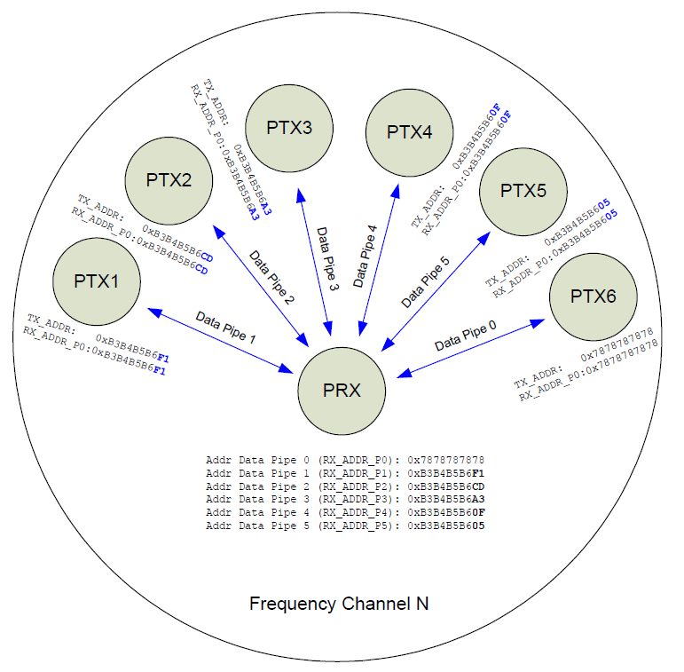
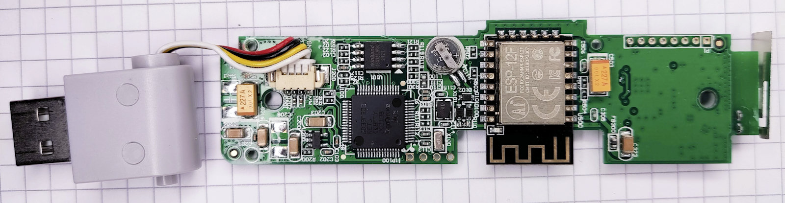
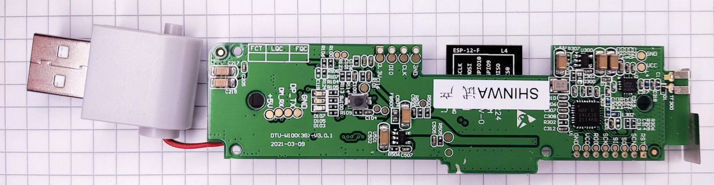
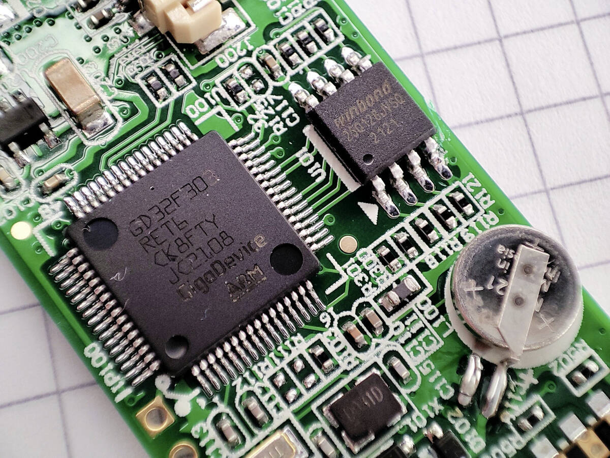
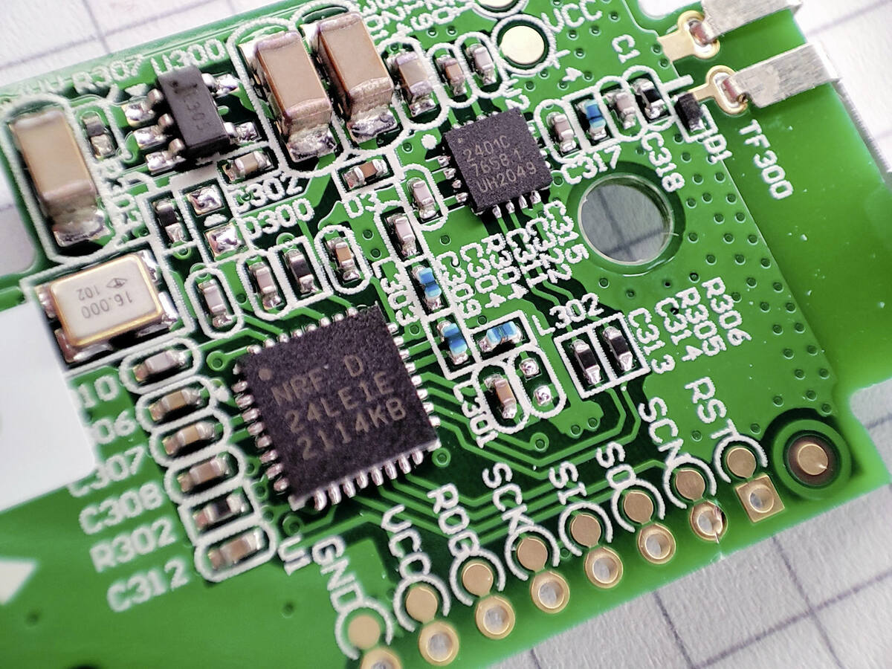
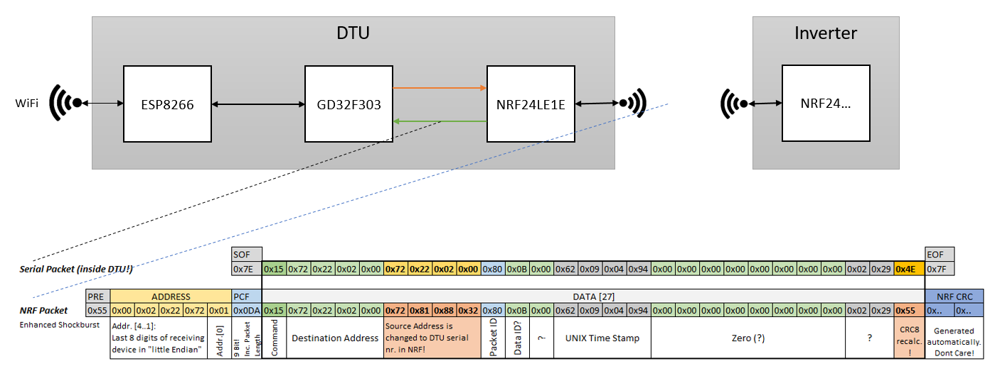
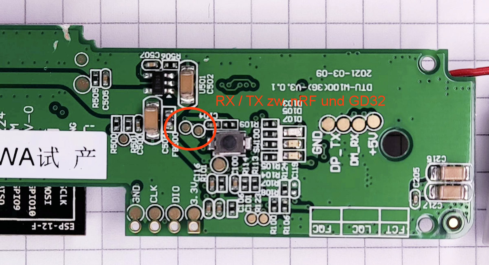
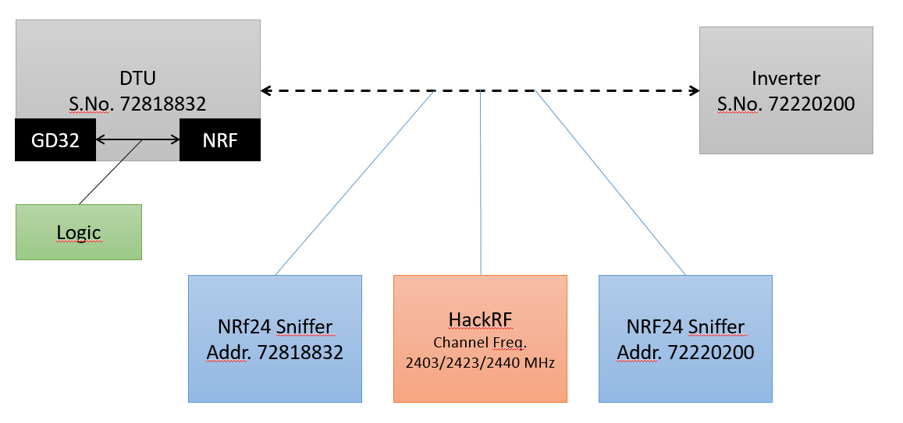

|  | Ahoy! A Hoymiles DTU Projekt |
|---------------------------|------------------------------|


Inhaltsverzeichnis
==================

- [Inhaltsverzeichnis](#inhaltsverzeichnis)
- [Ziel dieses Projekts](#ziel-dieses-projekts)
- [About this Document](#about-this-document)
  - [Origin, Contributors](#origin-contributors)
- [Systemaufbau](#systemaufbau)
    - [ABBILDUNG 1: Systemübersicht](#abbildung-1-systemübersicht)
      - [Enhanced ShockBurst (ESB)](#enhanced-shockburst-esb)
    - [ABBILDUNG 2: Innerer Aufbau "DTU"](#abbildung-2-innerer-aufbau-dtu)
      - [Oberseite: GigaDevices GD32F303, Espressif ESP-12F](#oberseite-gigadevices-gd32f303-espressif-esp-12f)
      - [Unterseite: Nordic Semiconductors nRF12LE1E](#unterseite-nordic-semiconductors-nrf12le1e)
    - [ABBILDUNG 3: Detailansicht GD32F303 - NRF24LE1E](#abbildung-3-detailansicht-gd32f303---nrf24le1e)
      - [Detail Oberseite: GigaDevices GD32F303, Winbond 25012](#detail-oberseite-gigadevices-gd32f303-winbond-25012)
      - [Detail Unterseite: Nordic Semiconductors nRF12LE1E, 2401C](#detail-unterseite-nordic-semiconductors-nrf12le1e-2401c)
      - [Diagramm: Nordic Kommunikations Schema](#diagramm-nordic-kommunikations-schema)
      - [Detail Unterseite: RX/TX zwischen GD32F303 und nRF12LE1E, Testpunkte für SWD Port und USB Schnittstelle](#detail-unterseite-rxtx-zwischen-gd32f303-und-nrf12le1e-testpunkte-für-swd-port-und-usb-schnittstelle)
      - [Diagramm: Test Setup mit Logic Analyser, HackRF und zwei NRf24 Sniffern](#diagramm-test-setup-mit-logic-analyser-hackrf-und-zwei-nrf24-sniffern)
- [Adressierung](#adressierung)
    - [ABBILDUNG 4: Enhanced Shockburst On-Air Data Format](#abbildung-4-enhanced-shockburst-on-air-data-format)
- [Seriennummern](#seriennummern)
- [Nachrichten](#nachrichten)
  - [Encapsulated Packets](#encapsulated-packets)
    - [Nachricht: DTU an WR: "Init" (?)](#nachricht-dtu-an-wr-init-)
    - [Nachricht: DTU an WR: "Init 2" (?)](#nachricht-dtu-an-wr-init-2-)
    - [Nachricht 0x80: DTU an WR: "Zeit setzen" (?)](#nachricht-0x80-dtu-an-wr-zeit-setzen-)
    - [Nachricht 0x81: DTU an WR: "Anfrage DC-Daten" (?)](#nachricht-0x81-dtu-an-wr-anfrage-dc-daten-)
    - [Nachricht 0x82: DTU an WR: "Anfrage AC-Daten" (?)](#nachricht-0x82-dtu-an-wr-anfrage-ac-daten-)
    - [Nachricht 0x83: DTU an WR: "Anfrage DC-Daten" (?)](#nachricht-0x83-dtu-an-wr-anfrage-dc-daten-)
    - [Nachricht 0x85: DTU an WR: "???" (?)](#nachricht-0x85-dtu-an-wr--)
    - [Nachricht 0xFF: DTU an WR: "???" (?)](#nachricht-0xff-dtu-an-wr--)
    - [Nachricht 0x01: WR an DTU: "Aktuelle DC Daten" (?)](#nachricht-0x01-wr-an-dtu-aktuelle-dc-daten-)
    - [Nachricht 0x02: WR an DTU: "Aktuelle AC Daten" (?)](#nachricht-0x02-wr-an-dtu-aktuelle-ac-daten-)
    - [Nachricht 0x83: WR an DTU (?): "???" (nach CMD wäre das eher auch eine Antwort vom WR?)](#nachricht-0x83-wr-an-dtu---nach-cmd-wäre-das-eher-auch-eine-antwort-vom-wr)
  - [Hinweise](#hinweise)
  - [Enhanced Shockburst Payloads](#enhanced-shockburst-payloads)
    - [CMD 0x80: DTU --> WR: "Set time/date" (?)](#cmd-0x80-dtu----wr-set-timedate-)
    - [CMD 0x01: WR --> DTU: "Current DC data" (?) (shown for an HM-700 and HM-400)](#cmd-0x01-wr----dtu-current-dc-data--shown-for-an-hm-700-and-hm-400)
    - [Nachricht 0x02: WR an DTU: "Aktuelle AC Daten" (?)](#nachricht-0x02-wr-an-dtu-aktuelle-ac-daten--1)
    - [CMD 0x82: WR --> DTU: "???" (?) (shown for an HM-400)](#cmd-0x82-wr----dtu---shown-for-an-hm-400)
    - [Nachricht 0x83: WR an DTU (?): "???" (nach CMD wäre das eher auch eine Antwort vom WR?)](#nachricht-0x83-wr-an-dtu---nach-cmd-wäre-das-eher-auch-eine-antwort-vom-wr-1)
- [Legend](#legend)
- [Glossary](#glossary)
- [Notizen](#notizen)
- [References](#references)
- [Revision History](#revision-history)

Ziel dieses Projekts
====================

Anstelle der DTU wollen wir direkt von einem Arduino/RaspberryPi o.ä.
die aktuellen Betriebsdaten der Wechselrichter auslesen.

Ohne Umweg über die "S-Miles Cloud".

Das Projekt basiert auf den Diskussionen und Erkenntnissen im Mikrocontroller Forum
[Wechselrichter Hoymiles HM-xxxx 2,4 GhZ Nordic Protokoll?](https://www.mikrocontroller.net/topic/525778) [1.].

About this Document
===================

This description aims to document the data format that Hoymiles
micro inverters use to communicate their current operating state.

The original Hoymiles setup requires connectivity to "the cloud",
see [this section below](#system-description).

With the information documented here, it is possible to interact with 
a set of Hoymiles micro inverters in a purely "offline" way, i.e.
without requiring internet access or any connectivity to a "cloud".

The only required hardware is a Nordic "NRF24L01+" wireless module.

The `ahoy` project at [AHOY Communications Project](https://github.com/grindylow/ahoy) [6.]
collects software for various platforms, including Arduino and RaspberryPi.

> Note: Some of the sections in this document are (still) in German. Translations
> may be provided if and when necessary.

Origin, Contributors
--------------------

The information in this document was gathered in a large community
effort which started out with
[this post that started the community effort](https://www.mikrocontroller.net/topic/525778) [1.] on the German
[mikrocontroller.net](https://www.mikrocontroller.net) [2.] forum.

As of April 2022, this effort is still ongoing. Not all details have
been documented yet, and not all secrets have been uncovered.

Multiple members of the community have already successfully retrieved (and
continue to successfully retrieve) data from their Hoymiles micro inverters.

Here's a list of some of the early contributors:

- sorbit: created the original mikrocontroller.net thread
- Martin (Gast): DTU and RF analysis
- Hubi: protocol analysis
- Marcel: initial analysis and much logging and interpretation
- Pascal A. (pasarn): various datagram fields, crc8
- Frank H. (fh_): discovered time_t
- Thomas B. (tbnobody): protocol analysis, logging
- Arnaldo G. (arnaldo_g): data capturing
- Oliver F (of22): protocol analysis, logging
- Martin G. (petersilie): protocol analysis, logging, RaspberryPi


Systemaufbau
============

Ein Setup wie von Hoymiles vorgesehen, sieht wie folgt aus:

- Eine "DTU" kommuniziert mit vielen Wechselrichtern.
- Die Kommunikation geht immer von der DTU aus:
  DTU stellt Anfrage und erwartet eine Antwort vom WR.
- Dafür muss die DTU die Adressen (=Seriennummern) aller WR kennen.
- Diese werden der DTU im Rahmen eines Einrichtungsprozesses beigebracht.

### ABBILDUNG 1: Systemübersicht  

```ditaa {cmd=true args=["-E"]}

                 Nordic
            "Enh. Shockburst"
                 2.4 GHz
      \|/ <-----------------> \|/
       |                       |
   +-------+                +-----------+
   |  DTU  |                | MI-600    |
   +-------+                +-----------+-+
                              | MI-1500   |
                              +-----------+-+
                                | MI-...    |
                                +-----------+
                                     :
                                     :
        ABBILDUNG 1: Systemübersicht
```

#### Enhanced ShockBurst (ESB)

<!-- 

-->

ESB features automatic packet transaction handling for easy implementation of a reliable bidirectional data link. A transaction is a packet exchange between two transceivers, with one transceiver acting as the Primary Receiver (PRX) and the other transceiver acting as the Primary Transmitter (PTX).



### ABBILDUNG 2: Innerer Aufbau "DTU"

```ditaa {cmd=true args=["-E"]}

                               Nordic
      WLAN                "Enh. Shockburst"
                               2.4 GHz
      \|/                        \|/
       |                          |
  +---------+               +-----------+
  | ESP8266 |               | NRF24LE1E |
  +---------+               +-----------+
       ^                          ^
       |                          |
       |       +----------+       |
       +-----> | GD32F303 | <-----+
         (B)   +----------+   (C)
              
     ABBILDUNG 2: Innerer Aufbau "DTU"
```

#### Oberseite: GigaDevices GD32F303, Espressif ESP-12F



#### Unterseite: Nordic Semiconductors nRF12LE1E



### ABBILDUNG 3: Detailansicht GD32F303 - NRF24LE1E

```ditaa {cmd=true args=["-E"]}

                                               Nordic
                                         "Enh. Shockburst"
                           NRF24LE1E           2.4 GHz
                       +------------------+      \|/
   +----------+        |      |           |       |
   | GD32F303 | <----->|  µC  | NRF24L01+ |-------+
   +----------+   (C)  |      |           |
                       +------+-----------+
              
   ABBILDUNG 3: Detailansicht GD32F303 - NRF24LE1E
```

#### Detail Oberseite: GigaDevices GD32F303, Winbond 25012



#### Detail Unterseite: Nordic Semiconductors nRF12LE1E, 2401C



#### Diagramm: Nordic Kommunikations Schema



#### Detail Unterseite: RX/TX zwischen GD32F303 und nRF12LE1E, Testpunkte für SWD Port und USB Schnittstelle



#### Diagramm: Test Setup mit Logic Analyser, HackRF und zwei NRf24 Sniffern




Adressierung
============

Die Seriennummern der DTU und der WR werden wie folgt als Adressen für die
Kommunikation verwendet:

**Interne Kommunikation**: Die meisten Datenpakete enthalten Quell- und
Zieladresse der jeweiligen Gesprächspartner. Hier werden 4-Byte-Adressen
verwendet, die direkt aus den letzten 8 Stellen der Seriennummer des
Wechselrichters bzw. der DTU gewonnen werden:

Beispiel: Seriennummer `....72818832`

Innerhalb der Pakete auf (C) wird daraus die 4-Byte-Adresse
`0x72, 0x81, 0x88, 0x32` gebildet. Das ist die BCD-Darstellung
der letzen 8 Dezimalziffern.

**NRF24-Kommunikation**: Die zugehörige Shockburst Zieladresse ist 
ähnlich, aber die Byte-Reihenfolge wird umgedreht, und es wird ein `0x01`-Byte
am Ende ergänzt (Shockburst ist auf 5-Byte-Adressen eingestellt).

Um eine Nachricht an das Gerät mit o.g. Seriennummer zu senden
lautet die Shockburst-Zieladresse also (`0x32, 0x88, 0x81, 0x72, 0x01`).

**NRF24 addressing scheme**: Over the air, the inverters communicate using
the [Nordic "Enhanced Shockburst" Protocol][3] configured for
5-byte addresses.

The inverter serial number is converted into a "Shockburst" address
as follows:

- encode the final 8 digits of the serial number in BCD format:  
  `0x72, 0x81, 0x88, 0x32`
- reverse the order of the bytes:
  `0x32, 0x88, 0x81, 0x72`
- append a byte containing 0x01:
  `0x32, 0x88, 0x81, 0x72, 0x01`

In this example, the resulting "Shockburst" address is: 0x3288817201.

**Additional example**, this time for inverter with serial number `99973104619`:

The datasheet specifies the over-the-air packet format: "Most Significant Byte
(MSB) to the left" (cf [datasheet figure 11][3]) 

  `Address := Byte_4, Byte_3, Byte_2, Byte_1, Byte_0`   ("LSByte must be unique")

so `0x1946107301` results in 

  `19 46 10 73 01`  "on the wire"

Old-style NRF Libraries take `uint64_t` addresses. In this case, the correct
address to pass to the library would be `(uint64_t)0x1946107301ULL`.

The ["Optimized high speed nRF24L01+ driver"]](https://nrf24.github.io) [4.]
actually wants `uint8_t*`, which maybe makes more sense.
But apparently it still wants the bytes in order LSB to MSB (even though the chip
will then put them out in MSB-to-LSB order.

So in this case, the correct sequence of bytes to pass to the library
would be `\x01\x73\x10\x46\x19`.

Figure 4 below is an annotated example of an "Enhanced Shockburst" packet as
seen on the air.

### ABBILDUNG 4: Enhanced Shockburst On-Air Data Format

```dita {cmd=true args=["-E"]}
+----------+--------------------+--------------------+---------------------+------------+
| preamble | dst 5-byte-address | PCF (9-bit)        | payload (>=1 bytes) | 2-byte-CRC |
+----------+--------------------+--------------------+---------------------+------------+
|          |                    | e.g. 0x0d8:        |                     |            |
|  0x55    | addr[4]...addr[0]  | 0b011011  00  0    |                     |            |
|   or     | MSB ... LSB        | len=27    PID nACK |                     |            |
|  0xAA    |                    |                    |                     |            |
|          |                    | e.g. 0x0da         |                     |            |
|          |                    | 0b011011  01  0    |                     |            |
|          |                    | len027    PID nACK |                     |            |
+----------+--------------------+--------------------+---------------------+------------+

PCF: Packet control field
PID: Packet IDentification (to detect/avoid duplicates), cycles through 0...3

              FIGURE 4: Enhanced Shockburst On-Air Data Format
```


Seriennummern
=============

Hier eine auf die ersten vier Stellen gekürzte Liste aus der u.a. Tabelle

Wie man sehen kann sind die Seriennummern nicht ganz eindeutig.
Aber es sollte von der Zahl der Anschlüsse bzw. MPPT die im Wechselrichter verbaut sind
eigentlich hinkommen, so daß alle mit der selben Seriennummer zumindest einen ähnlichen
inneren Aufbau haben sollten.
Lediglich die maximale Leistung der Kanäle scheint sie noch zu unterscheiden.

[Hoymiles-SerialNumbers.xlsx](Hoymiles-SerialNumbers.xlsx) [5.]

| Name      | Seriennummer | Maximale Leistung |
| --------- | ------------ | ----------------- |
| MI-100    | `1011`       | 100 W             |
| MI-250    | `1020`       | 250 W             |
| MI-300    | `1021` Gen2  | 300 W (1x380Wpp)  |
| MI-350    | `1021` Gen2  | 350 W (1x440Wpp)  |
| MI-400    | `1021` Gen2  | 400 W (1x500Wpp)  |
| MI-?      | `1022` Gen3  |                   |
| MI-500    | `1040`       | 500 W             |
| MI-600    | `1041` Gen2  | 600 W (2x380Wpp)  |
| MI-700    | `1041` Gen2  | 700 W (2x440Wpp)  |
| MI-800    | `1041` Gen2  | 800 W (2x500Wpp)  |
| TSOL-M800 | `1041`       | 800 W             |
| MI-600    | `1042` Gen3  | 600 W (2x380Wpp)  |
| MI-700    | `1042` Gen3  | 700 W (2x440Wpp)  |
| MI-800    | `1042` Gen3  | 800 W (2x500Wpp)  |
| MI-1000   | `1060`       | 1000 W            |
| MI-1200   | `1061`       | 1200 W            |
| MI-1500   | `1061`       | 1500 W            |
| MI-?      | `1062`       |                   |
| HM-300    | `1121` Gen3  | 300VA (1x380Wpp)  |
| HM-350    | `1121` Gen3  | 350VA (1x440Wpp)  |
| HM-400    | `1121` Gen3  | 400VA (1x500Wpp)  |
| HM-600    | `1141` Gen3  | 600VA (2x380Wpp)  |
| HM-700    | `1141` Gen3  | 700VA (2x440Wpp)  |
| HM-800    | `1141` Gen3  | 800VA (2x500Wpp)  |
| HM-1000   | `1161` Gen3  | 1000VA (4x310Wpp) |
| HM-1200   | `1161` Gen3  | 1200VA (4x380Wpp) |
| HM-1500   | `1161` Gen3  | 1500VA (4x470Wpp) |
| HM-1500   | `1165` Gen3  |                   |
| DTU-G100  | `10D2`       |                   |
| DTU-W100  | `10D3`       |                   |
| DTU-Lite-S| `10D3`       |                   |
| DTU-Lite  | `10D6`       |                   |
| DTU-Pro   | `10F7`       |                   |
| DTU-Pro   | `10F8`       |                   |
| DTU-Pro   | `10FA`       |                   |
| DTU-Pro   | `10FB`       |                   |


Nachrichten
===========

Initial protocol analysis focused on the data exchanged on link (C) in figure (3).
Not all the frames observed on this link will result in an actual RF transmission,
and some translation/mangling/processing happens inside the NRF24LE1E, in particular

- replacement of serial numbers
- recalculation of CRCs

These packets (which are all framed in 0x7e...0x7f bytes) are described in section
[Encapsulated Packets](#encapsulated-packets) below.

More recent efforts focus mainly on the actual "Enhanced Shockburst" packets
that are transmitted over the air. These packets are described in section
[Enhanced Shockburst Payloads](#Enhanced-Shockburst-Payloads), and the 
information contained in this section is more up to date.


Encapsulated Packets
--------------------

These are packets as observed on Link (C) in figure (3).


### Nachricht: DTU an WR: "Init" (?)

```code
Nachricht: DTU an WR: "Init" (?)
----------------------------------------------------------------------------------------------------------------------------------------------

             7E   07   00 00 00 00      00 00 00 00      00    07    7F
             ^^   ^^   ^^^^^^^^^^^      ^^^^^^^^^^^            ^^    ^^
Bedeutung    SOF  MID  WR ser#          WR ser#           ?    CRC8  EOF
                                                                ?
```

<!--
--> 
```wavedrom
{signal: [
  {name:'Clock',     wave: 'p...........' },
  {name:'Data',      wave: 'x345.6.78.9x', data: '7E 07 00000000 00000000 00 07 7F' },
  {name:'Bedeutung', wave: 'x345.6.78.9x', data: 'SOF MID WRser# WRser# ? CRC8? EOF' },
  {name:'Request',   wave: '01.........0' }
],
 head:{
   text:'Nachricht: DTU an WR: "Init" (?)',
   tick:0,
   every:2
 },
 foot:{
   text:'Nachricht 07',
   tock:9
 },
}
```

### Nachricht: DTU an WR: "Init 2" (?)

```code
Nachricht: DTU an WR: "Init 2" (?)
----------------------------------------------------------------------------------------------------------------------------------------------

             7E   07   72 81 88 32      72 81 88 32      00    07    7F
             ^^   ^^   ^^^^^^^^^^^      ^^^^^^^^^^^            ^^    ^^
Bedeutung    SOF  MID  DTU ser#         DTU ser#          ?    CRC8  EOF
Einheit                BCD (letzte 8)   BCD (letzte 8)    ?     ?
Beispiel               72818832         72818832          ?   
```

<!-- 
-->
```wavedrom
{signal: [
  {name:'Clock',     wave: 'p...........' },
  {name:'Data',      wave: 'x345.6.78.9x', data: '7E 07 72818832 72818832 00 07 7F' },
  {name:'Bedeutung', wave: 'x345.6.78.9x', data: 'SOF MID WRser# WRser# ? CRC8? EOF' },
  {name:'Einheit',   wave: 'x..5.6.78.x.', data: 'BCD(last8) BCD(last8) ? ?' },
  {name:'Beispiel',  wave: 'x..5.6.x...x', data: '72818832 72818832' },
  {name:'Request',   wave: '01.........0' }
],
 head:{
   text:'Nachricht: DTU an WR: "Init 2" (?)',
   tick:0,
   every:2
 },
 foot:{
   text:'Nachricht 07',
   tock:9
 },
}
```

### Nachricht 0x80: DTU an WR: "Zeit setzen" (?)

```code
Nachricht 0x80: DTU an WR: "Zeit setzen" (?)
----------------------------------------------------------------------------------------------------------------------------------------------
                                                            |<-------------CRC16 'modbus' für CRC_M----------------->|
             7E   15   72 22 02 00      72 22 02 00      80 0B 00     62 09 04 9b      00 00     00 00   00 00   00 00     F2 68    F0    7F
             ^^   ^^   ^^^^^^^^^^^      ^^^^^^^^^^^      ^^           ^^^^^^^^^^^                                          ^^^^^    ^^    ^^
Bedeutung    SOF  MID  WR ser#          WR ser#          CMD  ?       TIME (UTC)                                           CRC_M    CRC8  EOF
Einheit                BCD (letzte 8)   BCD (letzte 8)        ?       [s]                                                  HI LO   
Beispiel               72220200         72220200              ?       2022-02-13                                              
                                                                      13:16:11
```

<!-- 
-->
```wavedrom
{signal: [
  {name:'Clock',     wave: 'p.......................' },
  {name:'',          wave: '', data: '' , node: '........a.......b......x' },
  {name:'Data',      wave: 'x345.6.7892.34567.89x', data: '7E 15 72220200 72220200 80 0B 00 6209049B 0000 0000 0000 0000 F268 F0 7F'},
  {name:'Bedeutung', wave: 'x345.6.7892.xxxx7.89x', data: 'SOF MID WRser# WRser# CMD ? ? TIME(UTC) CRC_M CRC8 EOF' },
  {name:'Einheit',   wave: 'x..5.6.x892.xxxx7.x9x', data: 'BCD(last8) BCD(last8) ? ? [s] HILO' },
  {name:'Beispiel',  wave: 'x..5.6.x..2.x.......x', data: '72818832 72818832 2022-02-13' },
  {name:'Beispiel',  wave: 'x.........2.x.......x', data: '13:16:11' },
  {name:'Request',   wave: '01..................0' }
],
 edge: [ 'a<->b CRC16 modbus für CRC_M' ],
 head:{
   text:'Nachricht 0x80: DTU an WR: "Zeit setzen" (?)',
   tick:0,
   every:2
 },
 foot:{
   text:'Nachricht 07',
   tock:9
 },
}
```

### Nachricht 0x81: DTU an WR: "Anfrage DC-Daten" (?)

```code
Nachricht 0x81: DTU an WR: "Anfrage DC-Daten" (?)
----------------------------------------------------------------------------------------------------------------------------------------------

GD->NRF     7E    15   70 51 43 68    70 51 43 68      81     xx       7F     ...... (NOCH NICHT VERIFIZIERT / GESEHEN)
                                      ^^^^^^^^^^^      ^^     ^^       ^^
                                       | (wird von     CMD    CRC8     EOF
                                       | NRF ersetzt)         | (wird von NRF
                                       v                      v neu berechnet)
                                                             
on-air            15   70 51 43 68    70 53 54 53      81     BA
(payload)              ^^^^^^^^^^^    ^^^^^^^^^^^
                       WR ser #       DTU ser #
```

<!-- 
-->

```wavedrom
{signal: [
  {name:'Clock',     wave: 'p..........' },
  {name:'',          wave: '', data: '' },
  {name:'Data',      wave: 'x345.6.7892.........x', data: '7E 15 70514368 70514368 81 xx 7F ...(NOCH_NICHT_VERIFIZIERT_/_GESEHEN)', 
                     node: '......a.c..' },
  {name:'', wave: '', data: ''},
  {name:'on-air (payload)',   
                     wave: 'x.45.6.78x.', data: '15 70514368 70535453 81 BA', 
                     node: '......b.d..' },
  {name:'Bedeutung', wave: 'x..5.6.789x', data: 'WRser# DTUser# CMD CRC8 EOF' },
  {name:'Request',   wave: '01........0' }
],
 edge: [ 'a~>b (wird von NRF ersetzt)', 'c~>d (wird von NRF neu berechnet)' ],
 head:{
   text:'Nachricht 0x81: DTU an WR: "Anfrage DC-Daten" (?)',
   tick:0,
   every:2
 },
 foot:{
   text:'Nachricht 07',
   tock:9
 },
}
```

### Nachricht 0x82: DTU an WR: "Anfrage AC-Daten" (?)

```code
Nachricht 0x82: DTU an WR: "Anfrage AC-Daten" (?)
----------------------------------------------------------------------------------------------------------------------------------------------

GD->NRF     7E    15   70 51 43 68    70 51 43 68      82     xx       7F     ...... (NOCH NICHT VERIFIZIERT / GESEHEN)
                                      ^^^^^^^^^^^      ^^     ^^       ^^
                                       | (wird von     CMD    CRC8     EOF
                                       | NRF ersetzt)         | (wird von NRF
                                       v                      v neu berechnet)
                                                             
on-air            15   70 51 43 68    70 53 54 53      82     B9
(payload)              ^^^^^^^^^^^    ^^^^^^^^^^^
                       WR ser #       DTU ser #
```

<!-- 
-->

```wavedrom
{signal: [
  {name:'Clock',     wave: 'p..........' },
  {name:'',          wave: '', data: '' },
  {name:'Data',      wave: 'x345.6.7892.........x', data: '7E 15 70514368 70514368 81 xx 7F ...(NOCH_NICHT_VERIFIZIERT_/_GESEHEN)', 
                     node: '......a.c..' },
  {name:'', wave: '', data: ''},
  {name:'on-air (payload)',   
                     wave: 'x.45.6.78x.', data: '15 70514368 70535453 81 BA', 
                     node: '......b.d..' },
  {name:'Bedeutung', wave: 'x..5.6.789x', data: 'WRser# DTUser# CMD CRC8 EOF' },
  {name:'Request',   wave: '01........0' }
],
 edge: [ 'a~>b (wird von NRF ersetzt)', 'c~>d (wird von NRF neu berechnet)' ],
 head:{
   text:'Nachricht 0x81: DTU an WR: "Anfrage DC-Daten" (?)',
   tick:0,
   every:2
 },
 foot:{
   text:'Nachricht 07',
   tock:9
 },
}
```


### Nachricht 0x83: DTU an WR: "Anfrage DC-Daten" (?)

```code
Nachricht 0x83: DTU an WR: "Anfrage DC-Daten" (?)
----------------------------------------------------------------------------------------------------------------------------------------------

GD->NRF     7E    15   70 51 43 68    70 51 43 68      83     xx       7F     ...... (NOCH NICHT VERIFIZIERT / GESEHEN)
                                      ^^^^^^^^^^^      ^^     ^^       ^^
                                       | (wird von     CMD    CRC8     EOF
                                       | NRF ersetzt)         | (wird von NRF
                                       v                      v neu berechnet)
                                                             
on-air            15   70 51 43 68    70 53 54 53      83     B8
(payload)              ^^^^^^^^^^^    ^^^^^^^^^^^
                       WR ser #       DTU ser #
```

### Nachricht 0x85: DTU an WR: "???" (?)

```code
Nachricht 0x85: DTU an WR: "???" (?)
----------------------------------------------------------------------------------------------------------------------------------------------

GD->NRF     7E    15   70 51 43 68    70 51 43 68      85     xx       7F     ...... (NOCH NICHT VERIFIZIERT / GESEHEN)
                                      ^^^^^^^^^^^      ^^     ^^       ^^
                                       | (wird von     CMD    CRC8     EOF
                                       | NRF ersetzt)         | (wird von NRF
                                       v                      v neu berechnet)
                                                             
on-air            15   70 51 43 68    70 53 54 53      85     BE
(payload)              ^^^^^^^^^^^    ^^^^^^^^^^^
                       WR ser #       DTU ser #
```

### Nachricht 0xFF: DTU an WR: "???" (?)

```code
Nachricht 0xFF: DTU an WR: "???" (?)
----------------------------------------------------------------------------------------------------------------------------------------------

GD->NRF     7E    15   70 51 43 68    70 51 43 68      FF     xx       7F     ...... (NOCH NICHT VERIFIZIERT / GESEHEN)
                                      ^^^^^^^^^^^      ^^     ^^       ^^
                                       | (wird von     CMD    CRC8     EOF
                                       | NRF ersetzt)         | (wird von NRF
                                       v                      v neu berechnet)
                                                             
on-air            15   70 51 43 68    70 53 54 53      FF     C4
(payload)              ^^^^^^^^^^^    ^^^^^^^^^^^
                       WR ser #       DTU ser #
```

### Nachricht 0x01: WR an DTU: "Aktuelle DC Daten" (?)

```code
Nachricht 0x01: WR an DTU: "Aktuelle DC Daten" (?)
----------------------------------------------------------------------------------------------------------------------------------------------

             7E   95   72 22 02 00      72 22 02 00      01 00 01      01 4c   03 bd   0c 46     00 b5   00 03   00 05     00 00    BD    7F
             ^^   ^^   ^^^^^^^^^^^      ^^^^^^^^^^^      ^^            ^^^^^   ^^^^^   ^^^^^     ^^^^^   ^^^^^   ^^^^^              ^^    ^^
Bedeutung    SOF  MID  WR ser#          WR ser#          CMD  ?        PV1.u   PV1.i   PV1.p     PV2.u   PV2.i   PV2.p       ?      CRC8  EOF
Einheit                BCD (letzte 8)   BCD (letzte 8)        ?        [0.1V]  [0.01A] [.1W]     [0.1V]  [0.01A] [.1W]       ?     
Beispiel               72220200         72220200              ?        33.2V   9.57A   317.2W    18.1V   0.03A   0.5W        ?     
```

### Nachricht 0x02: WR an DTU: "Aktuelle AC Daten" (?)

```code
Nachricht 0x02: WR an DTU: "Aktuelle AC Daten" (?)
----------------------------------------------------------------------------------------------------------------------------------------------

             7E   95   72 22 02 00      72 22 02 00      02 28 23      00 00   24 44   00 3C     00 00   09 0F   13 88     0B D5   83    7F
             ^^   ^^   ^^^^^^^^^^^      ^^^^^^^^^^^      ^^                                              ^^^^^   ^^^^^     ^^^^^   ^^    ^^
Bedeutung    SOF  MID  WR ser#          WR ser#          CMD  ?                  ?       ?               AC.u    AC.f      AC.p    CRC8  EOF
Einheit                BCD (letzte 8)   BCD (letzte 8)        ?                                          [0.1V]  [0.01Hz]  [0.1W]
Beispiel               72220200         72220200              ?                9284    60                231.9V  50.00Hz   302.9W
```

### Nachricht 0x83: WR an DTU (?): "???" (nach CMD wäre das eher auch eine Antwort vom WR?)

```code
Nachricht 0x83: WR an DTU (?): "???" (nach CMD wäre das eher auch eine Antwort vom WR?)
----------------------------------------------------------------------------------------------------------------------------------------------

             7E   95   72 22 02 00      72 22 02 00      83 00 03      00 83     03 E8     00 B2     00 0A     FD 26               1E    7F
             ^^   ^^   ^^^^^^^^^^^      ^^^^^^^^^^^      ^^                                                                        ^^    ^^
Bedeutung    SOF  MID  WR ser#          WR ser#          CMD  ?         ?          ?         ?         ?         ?                 CRC8  EOF
Einheit                BCD (letzte 8)   BCD (letzte 8)        ?                                                   
Beispiel               72220200         72220200              ?        131       1000      178       10                                           
```

Hinweise
--------

Die "on-air (payload)" Bytes geben nur die Nutzlast der gesendeten Shockburst-Pakete an.
Intern enthalten diese Pakete auch die Zieladresse, die Länge, eine CRC.

*****************************************************************************************

Enhanced Shockburst Payloads
----------------------------

- These are the packets that are exchanged between inverters and DTU via the Nordic
  "Enhanced Shockburst" protocol.
- Each payload is preceded by a preamble, and terminated by a 16-bit CRC, as described
  in the [Nordic NRF24LE01+ datasheet](https://infocenter.nordicsemi.com/pdf/nRF24LE1_PS_v1.6.pdf) [3.].
  See also figure 4 above.


### CMD 0x80: DTU --> WR: "Set time/date" (?)

```code
CMD 0x80: DTU --> WR: "Set time/date" (?)
----------------------------------------------------------------------------------------------------------------------------------------------
                                           |<-------------CRC16 'modbus' für CRC_M----------------->|
            15   72220200  72220200   80   0B 00    62 09 04 9b       00 00     00 00   00 00   00 00     F2 68    F0  
            ^^   ^^^^^^^^  ^^^^^^^^   ^^   ^^^^^    ^^^^^^^^^^^                 ^^^^^                     ^^^^^    ^^  
Name        MID  DTU_SER#  DTU_SER#   CMD  uk1      TIME (local)                SEQ?                      CRC_M    CRC8
Units            see "addressing"           ?       [s-since-epoch]                                       HI LO   
Example          72220200  72220200         ?       2022-02-13                                               
                                                    13:16:11                                                 
```

- This message will cause the inverter to transmit a CMD=0x01, CMD=0x02, and, occasionally, also a CMD=0x83 message
  to the DTU with serial number DTU_SER#.
- Values of "0xb0, 0x00" and "0x11, 0x00" have been observed for "UK1". Their meaning is unknown.
- "SEQ" was observed to contain increasing numbers when sent by a Hoymiles DTU. In particular,
  each issued "command" (e.g. "switch inverter on", "switch inverter off") appears to increase this
  value. A constant value of 0x0000 or 0x0005 appears to work just fine.
- Repeatedly sending the same TIME information (instead of correctly increasing time) 
  [has been shown](https://www.mikrocontroller.net/topic/525778?page=2#7021386) [1. a)] to result
  in identical behaviour, the inverter still replies as described above. 


### CMD 0x01: WR --> DTU: "Current DC data" (?) (shown for an HM-700 and HM-400)

```code
CMD 0x01: WR --> DTU: "Current DC data" (?) (shown for an HM-700 and HM-400)
----------------------------------------------------------------------------------------------------------------------------------------------
HM-700 (2-channel):
            95   72 22 02 00      72 22 02 00      01 00 01      01 4c   03 bd   0c 46     00 b5   00 03   00 05     00 00    BD    7F
            ^^   ^^^^^^^^^^^      ^^^^^^^^^^^      ^^            ^^^^^   ^^^^^   ^^^^^     ^^^^^   ^^^^^   ^^^^^              ^^    ^^
NameMID          WR ser#          WR ser#          CMD  ?        PV1.u   PV1.i   PV1.p     PV2.u   PV2.i   PV2.p       ?      CRC8  EOF
Units            BCD (letzte 8)   BCD (letzte 8)        ?        [0.1V]  [0.01A] [.1W]     [0.1V]  [0.01A] [.1W]       ?     
Example          72220200         72220200              ?        33.2V   9.57A   317.2W    18.1V   0.03A   0.5W        ?     


HM-400 (1-channel):
byte        00   01 02 03 04      05 06 07 08      09 10 11      12 13   14 15   16 17     18 19   20 21   22 23     24 25  26 27  28    29
            95   73 10 xx yy      73 10 xx yy      01 00 01      01 9A   00 46   01 21     00 00   FA E6   00 84     09 0C  F5 DD  BD    7F
            ^^   ^^^^^^^^^^^      ^^^^^^^^^^^      ^^            ^^^^^   ^^^^^   ^^^^^     ^^^^^^^^^^^^^   ^^^^^     ^^^^^  ^^^^^  ^^    ^^
NameMID          WR ser#          WR ser#          CMD  ?        PV1.u   PV1.i   PV1.p      DC? P total?  DC? P day   V AC         CRC8  EOF
Units            BCD (letzte 8)   BCD (letzte 8)        ?        [0.1V]  [0.01A] [.1W]        [0.001kWh]   [1Wh]     [0.1V]   ?
Example          7310xxyy         7310xxyy              ?        41.0V    0.70A  28.9W        64.23kWh     132Wh     231.6V   ?

legend
PVx.u:    DC voltage of panel x
PVx.i:    DC current of panel x
PVx.p:    DC power of panel x
WR ser#:  inverter serial, e.g. 11217310xxyy (HM-400) => 7310xxyy
P tot:    DC (or AC)? power total (monthly/yearly?)
P day:    DC (or AC)? power daily
V AC:     AC voltage
```

- The exact meaning of the contents of this message varies depending on inverter type. So far, the following variants have been observed:
  - HM-300/350/400 (single channel):
  - HM-600/700/800 (2-channel):
  - HM-1000/1200/1500 (4-channel):

```code
TODO TODO TODO
73109025   73109025   01        00  01     014F      0003      000B    0000  40AE  03AC     08E6       7C
                                           ^^^^      ^^^^      ^^^^                ^^^^     ^^^^
                                           335       3         11                  940      2278
                                           33.5V     0.03A     1.1W                940W     22.78kW

95     71603546   71603546   01        00  01     015D      004D      00B3    010C  0270  0001     3419       64   B327 B327 1
                                                  ^^^^      ^^^^      ^^^^                ^^^^     ^^^^
                                                  349       77        179                 1        13337
                                                  34.9V     0.77A     1.79W               1        133.37kW
```


### Nachricht 0x02: WR an DTU: "Aktuelle AC Daten" (?)

```code
Nachricht 0x02: WR an DTU: "Aktuelle AC Daten" (?)
----------------------------------------------------------------------------------------------------------------------------------------------

             7E   95   72 22 02 00      72 22 02 00      02 28 23      00 00   24 44   00 3C     00 00   09 0F   13 88     0B D5   83  
             ^^   ^^   ^^^^^^^^^^^      ^^^^^^^^^^^      ^^                                              ^^^^^   ^^^^^     ^^^^^   ^^  
Bedeutung    SOF  MID  WR ser#          WR ser#          CMD  ?                  ?       ?               AC.u    AC.f      AC.p    CRC8
Einheit                BCD (letzte 8)   BCD (letzte 8)        ?                                          [0.1V]  [0.01Hz]  [0.1W]
Beispiel               72220200         72220200              ?                9284    60                231.9V  50.00Hz   302.9W
```
- The exact meaning of the contents of this message varies depending on inverter type. So far, the following variants have been observed:
  - until now, message never observed using a HM-400


### CMD 0x82: WR --> DTU: "???" (?) (shown for an HM-400)

```code
CMD 0x82: WR --> DTU: "???" (?) (shown for an HM-400)
----------------------------------------------------------------------------------------------------------------------------------------------
HM-400 (1-channel):
byte        00   01 02 03 04      05 06 07 08      09  10 11      12 13   14 15   16 17     18 19   20 21   22 23     24 25  26 27  28    29
            95   73 10 xx yy      73 10 xx yy      82  13 8A      01 1C   00 00   00 0C     03 E8   00 65   00 06     3C 1D  36 9E  8D    1
            ^^   ^^^^^^^^^^^      ^^^^^^^^^^^      ^^  ^^^^^      ^^^^^   ^^^^^   ^^^^^     ^^^^^   ^^^^^   ^^^^^     ^^^^^  ^^^^^  ^^    ^^
NameMID          WR ser#          WR ser#          CMD Freq       P AC     ?      I AC        ?     Temp      ?         ?      ?   CRC8?  EOF?
Units            BCD (letzte 8)   BCD (letzte 8)       [0.01Hz]   [0.1W]   ?      [0.01A]     ?    [0.1°C]    ?         ?      ?
Example          7310xxyy         7310xxyy             50,02Hz    28,40W   ?      0,120A      ?    10,10°C    ?         ?      ?

legend
Freq:     frequency of inverter
P AC:     AC power of inverter
I AC:     AC current of inverter
Temp:     temperature of inverter
WR ser#:  inverter serial, e.g. 11217310xxyy (HM-400) => 7310xxyy
```

### Nachricht 0x83: WR an DTU (?): "???" (nach CMD wäre das eher auch eine Antwort vom WR?)


```code
Nachricht 0x83: WR an DTU (?): "???" (nach CMD wäre das eher auch eine Antwort vom WR?)
----------------------------------------------------------------------------------------------------------------------------------------------

             95   72 22 02 00      72 22 02 00      83 00 03      00 83     03 E8     00 B2     00 0A     FD 26               1E  
             ^^   ^^^^^^^^^^^      ^^^^^^^^^^^      ^^                                                                        ^^  
Bedeutung    MID  WR ser#          WR ser#          CMD  ?         ?          ?         ?         ?         ?                 CRC8
Einheit           BCD (letzte 8)   BCD (letzte 8)        ?                                                   
Beispiel          72220200         72220200              ?        131       1000      178       10                                           
```


Legend
======

**MID**: Message-ID. Antworten haben Bit 7 gesetzt,

  * z.B. Frage `0x15` --> Antwort `0x95`.
  * z.B. Frage `0x07` --> Antwort `0x87`.

  Für Kommunikation GD <--> NRF

**CMD**: 

  Befehl an den WR hat Bit 7 gesetzt

  * `0x80` "Zeit setzen"
  * `0x81` "Anfrage DC-Daten", erwartete Antwort: `0x01`
  * `0x82` "Anfrage AC-Daten", erwartete Antwort: `0x02`
  * `0x83` "?"
  * `0x85` "?"
  * `0xFF` "?"

  Antworten vom WR haben Bit 7 gelöscht:

  * `0x01` "Aktuelle DC-Daten"
  * `0x02` "Aktuelle AC-Daten"

**SOF**: Start-of-Frame `0x7E`

**EOF**: End-of-Frame `0x7F`

**CRC8**: CRC8 mit poly=1 init=0 xor=0, für alle Bytes zwischen SOF und CRC8.

  Beispiel in Python:

    ```code
      >>> import crcmod
      >>> f = crcmod.mkCrcFun(0x101, initCrc=0, xorOut=0)
      >>> payload = bytes((0x95,0x72,0x22,0x02,0x00,0x72,0x22,0x02,0x00,0x83,0x00,0x03,0x00,0x83,0x03,0xE8,0x00,0xB2,0x00,0x0A,0xFD,0x26))
      >>> hex(f(payload))
      '0x1e'
    ```

**CRC_M**: CRC16 wie für "Modbus"-Protokoll, High-Byte gefolgt von Low-Byte

  Beispiel in Python:

  ```code
    >>> import crcmod
    >>> f = crcmod.predefined.mkPredefinedCrcFun('modbus')
    >>> payload = bytes((0x0B,0x00,0x62,0x2F,0x45,0x96,0x00,0x00,0x00,0x00,0x00,0x00,0x00,0x00))
    >>> hex(f(payload))
    '0x3bd6'
  ```

**TIME**: Aktuelle (DTU-)Zeit als Unix `time_t` (Sekunden seit 1970-01-01)

Glossary
========

- **WR**: Wechselrichter (inverter)

- **DTU**: Data Terminal Unit (?). Die Hoymiles-Bezeichnung für den Kommunikations-Master.

- **BCD**: Binary Coded Decimal

Notizen
=======

```code
0x014c = 332
0x03bd = 957
0x0c64 = 3172
0x6209049b = 1644758171
datetime.datetime.utcfromtimestamp(0x6209049b) =
datetime.datetime(2022, 2, 13, 13, 16, 11)
```

References
==========

1. [The post that started the community effort](https://www.mikrocontroller.net/topic/525778)
2. [mikrocontroller.net](https://www.mikrocontroller.net)
3. [Nordic NRF24LE01+ datasheet](https://infocenter.nordicsemi.com/pdf/nRF24LE1_PS_v1.6.pdf)
4. [Optimized high speed nRF24L01+ driver documentation](https://nrf24.github.io/RF24)
5. [Hoymiles-SerialNumbers.xlsx](https://github.com/grindylow/ahoy/doc/Hoymiles-SerialNumbers.xlsx)
6. [AHOY Communications Project](https://github.com/grindylow/ahoy)

Revision History
================

Datum      | Autor      | Version | Änderungen
-----------|------------|---------|-----------------------------------------------------
2022-03-09 | Petersilie | erste Version
2022-03-10 | Petersilie | r2 | Nachrichten "02 28 23" und "82 00 03" ergänzt. Sauberer ausgerichtet. Python Beispiel für CRC.
2022-03-12 | Petersilie | r3 | Erste on-air Formate hinzu. CMD-IDs hinzu. Neue Nachrichten von arnaldo_g hinzu. Übersicht hinzu.
2022-03-15 | Petersilie | r4 | Nachricht 0x80: Mystery-Bytes am Ende "dechiffriert"
2022-03-16 | Petersilie | r5 | ESP ist ein ESP8266, nicht ESP32 (danke an @tbnobody)
2022-03-27 | Petersilie | Versionierung ab jetzt via Github.
2022-05-01 | isnoAhoy   | r7 | Version als MarkDown formatiert, wavedrom Diagramme, HTML & PDF Export
