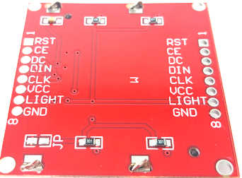

# PCB for Wemos D1 + Nokia5110-display + nRF24L01+

Simple pcb to plug a nRF24L01+ together with a Wemos D1 Mini / Pro and a NOKIA5110-display (known as PCD8544). You can power this pcb via USB-interface of D1-mini.

attached zip was created with easyeda. You can order easyly on jlcpcb.com.

Attention: Be sure you have the right type of nokia-display-pcb !
Check pin-header-description (There are different versions avail)!
( check picture : LIGHT (or BL) is placed between GND and VCC )

![img]Nokia5110-LCD.jpg) or 

You can use this PCB also without mounting a Nokia-display on backside !
